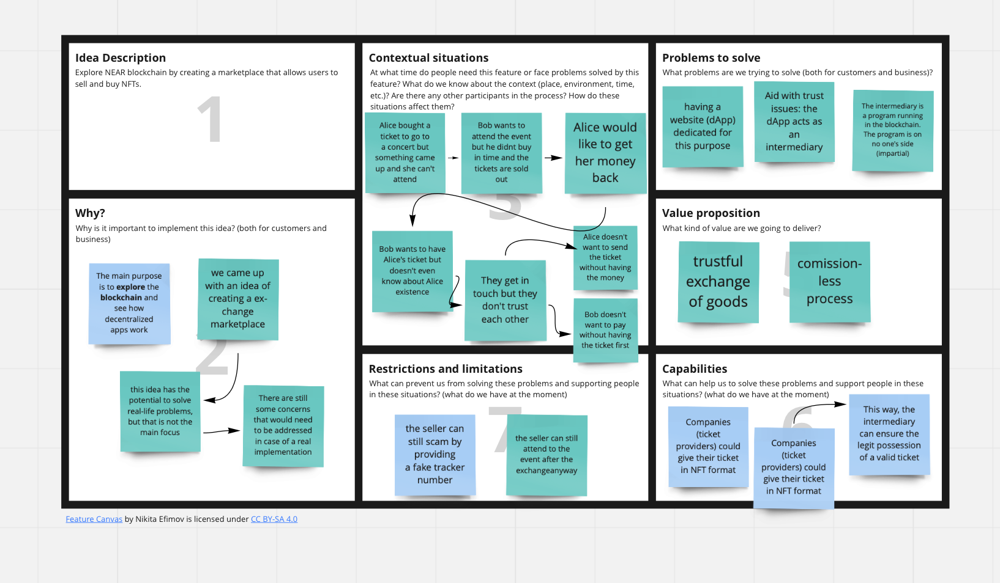

Ticketasos
==========

Sign in with [NEAR] and sell the tickets of the events you cannot attend! A starter app built with a [Rust](https://www.rust-lang.org) backend and a [React] frontend.

The motivation
===============

Quick Start
===========

To run this project locally:

1. Prerequisites: Make sure you have Node.js ≥ 12 installed (https://nodejs.org), then use it to install [yarn]: `npm install --global yarn` (or just `npm i -g yarn`)
2. Run the local development server: `yarn && yarn dev` (see `package.json` for a
   full list of `scripts` you can run with `yarn`)
3. I created one account "ticketasos.testnet" and two subaccounts, one for the NFT contract (nft.ticketasos.testnet) and one for the marketplace (market.ticketasos.testnet):

- `near create-account nft.ticketasos.testnet --masterAccount ticketasos.testnet`

- `near create-account market.ticketasos.testnet --masterAccount ticketasos.testnet`

4. Compile and Deploy both contracts.
There is one folder for each contract. The backend code lives in the _backend_ folder and the frontend code (the website of the marketplace) lives in the _frontend_ folder.
- to compile (in each folder):
`./build.sh`

- to deploy the nft contract: `near deploy --wasmFile nft_simple.wasm --accountId nft.ticketasos.testnet`
- to deploy the market contract: `near deploy --wasmFile market.wasm --accountId market.ticketasos.testnet`

As a user of the dapp and owner of the token, you need to fund the marketplace for the storage you will use: 
`near call market.ticketasos.testnet storage_deposit '{"account_id": "bravado.testnet"}' --accountId bravado.testnet --deposit 6`)

5. Another contracts that I used during development:
- `near call market.ticketasos.testnet get_sales_by_nft_contract_id '{"nft_contract_id": "nft.ticketasos.testnet", "limit": 10}' --accountId bravado.testnet`

- `near call market.ticketasos.testnet offer '{"nft_contract_id": "nft.ticketasos.testnet", "token_id":"fbbc0db9-1e9c-4e39-9a04-118ee3038737"}' --accountId bravado.testnet --deposit 5 --gas 300000000000000`
